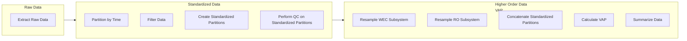

# HERO WEC Electrical Deployment Data Standardization

This script processes raw measurement data stored in MODAQ format for engineering analysis. It includes functions to extract, filter, partition, visualize, perform quality control, and organize the data for further analysis.

## Features

- Extraction of raw data from multiple sources (TDMS, ROS Bagfiles, CSV, NC)
- Partitioning data by time
- Filtering data
- Creating standardized partitions
- Performing quality control on standardized partitions
- Resampling subsystems to align data with different sampling rates
- Concatenating partitions
- Calculating Value-Added Products (VAP)
- Summarizing processed data

## Data Flow



## Requirements

- Python 3.7+
- Required Python packages (install via `requirements.txt`)

## Installation

1. **Clone the repository:**

   ```sh
   git clone https://your-repository-url.git
   cd your-repository
   ```

2. **Create a virtual environment:**

   ```sh
   python -m venv venv
   ```

3. **Activate the virtual environment:**

   - On Windows:
     ```sh
     venv\Scripts\activate
     ```
   - On macOS and Linux:
     ```sh
     source venv/bin/activate
     ```

4. **Install the required packages:**
   ```sh
   pip install -r requirements.txt
   ```

## Usage

1. **Prepare your raw data:**

   Ensure your raw data is organized in the following folder structure within a directory named `00_raw_data`:

   ```
   00_raw_data/
   ├── CurrentAI/
   ├── PowRaw/
   ├── VoltageAI/
   ├── BuoyBagfiles/
   ├── MooringDAQ/
   └── Weather/
   ```

2. **Run the script:**

   ```sh
   python path/to/your/script.py
   ```

   The script will automatically execute the following steps:

   - **Step 1: Extracting raw data**
     - Extracts data from TDMS, ROS Bagfiles, CSV, and NC formats into a unified format.
   - **Step 2: Partitioning**
     - Partitions the extracted data by time.
   - **Step 3: Filtering**
     - Filters the partitioned data.
   - **Step 4: Creating Standardized Partitions**
     - Standardizes the filtered data and performs quality control.
     - Resamples WEC and RO subsystems.
     - Concatenates standardized partitions.
   - **Step 5: Calculating VAP**
     - Calculates Value-Added Products from standardized partitions.
   - **Step 6: Summarizing**
     - Summarizes the VAP partitions.

3. **Output Data:**

   The processed data will be stored in the following folders:

   ```
   data/
   ├── 00_raw_data/
   ├── a1_interim_one_to_one_parquet/
   ├── a2_interim_partitioned/
   ├── a3_interim_filtered_parquet/
   ├── a4_standardized_partition/
   ├── b1_standardized_vap_partition/
   └── b2_summary_standardized_vap/
   ```
